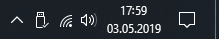
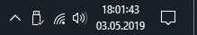
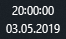
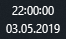
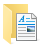

#  windows-registry
Just some useful Registry Stuff.
For general Information about the Windows Registry see e.g. [Wikipedia](https://en.wikipedia.org/wiki/Windows_Registry).

---

## Disclaimer
THE SOFTWARE IS PROVIDED "AS IS", WITHOUT WARRANTY OF ANY KIND, EXPRESS OR
IMPLIED, INCLUDING BUT NOT LIMITED TO THE WARRANTIES OF MERCHANTABILITY,
FITNESS FOR A PARTICULAR PURPOSE AND NONINFRINGEMENT. IN NO EVENT SHALL THE
AUTHORS OR COPYRIGHT HOLDERS BE LIABLE FOR ANY CLAIM, DAMAGES OR OTHER
LIABILITY, WHETHER IN AN ACTION OF CONTRACT, TORT OR OTHERWISE, ARISING FROM,
OUT OF OR IN CONNECTION WITH THE SOFTWARE OR THE USE OR OTHER DEALINGS IN THE
SOFTWARE.

For more Information see [License](./LICENSE).

---

## 1. Show Seconds in System Clock
### Effect
| Before | After |
|--------|-------|
|||

### Registry Value
```
  Key: HKEY_CURRENT_USER\Software\Microsoft\Windows\CurrentVersion\Explorer\Advanced
Value: ShowSecondsInSystemClock
 Type: DWORD
 Data: 0x00000001
```

### \*.reg Files
**Enable:** [file coming soon]()

**Disable (Windows default):** [file coming soon]()

### Required Action
- [ ] **Reopen or refresh**
- [x] **Log off**
- [ ] **Restart**

---

## 2. Real Time is universal
### Effect
Configures Windows to use [UTC](https://en.wikipedia.org/wiki/Coordinated_Universal_Time) instead of Local Time for [RTC](https://en.wikipedia.org/wiki/Real-time_clock).
This is especially practical for Dual-Boot Systems with Windows and Linux.
See [Archlinux Wiki](https://wiki.archlinux.org/index.php/System_time#UTC_in_Windows) for more Information.

| Before | After |
|--------|-------|
|||

### Registry Value
```
  Key: HKEY_LOCAL_MACHINE\SYSTEM\CurrentControlSet\Control\TimeZoneInformation
Value: RealTimeIsUniversal
 Type: DWORD
 Data: 0x00000001
```

### \*.reg Files
**Enable:** [file coming soon]()

**Disable (Windows default):** [file coming soon]()

### Required Action
- [ ] **Reopen or refresh**
- [ ] **Log off**
- [x] **Restart**

---

## 3. User Folders
### Effect
Removes User Folders from 'This PC' View and Tree in the File Explorer.
The Folders are still available through the User Folder itself.
See [Wikipedia](https://en.wikipedia.org/wiki/File_Explorer) for more Information.

| Before | After |
|--------|-------|
| 3D Objects| removed from 'This PC' View and Tree |
| Desktop | removed from 'This PC' View and Tree |
| Documents | removed from 'This PC' View and Tree |
| Downloads | removed from 'This PC' View and Tree |
| Music | removed from 'This PC' View and Tree |
| Pictures | removed from 'This PC' View and Tree |
| Videos | removed from 'This PC' View and Tree |

### Registry Values
```
3D Objects:
-----------
Key:
Value:
Type:
Data:
```
```
Desktop:
--------
Key:
Value:
Type:
Data:
```
```
Documents:
----------
Key:
Value:
Type:
Data:
```
```
Downloads:
----------
Key:
Value:
Type:
Data:
```
```
Music:
------
Key:
Value:
Type:
Data:
```
```
Pictures:
---------
Key:
Value:
Type:
Data:
```
```
Videos:
-------
Key:
Value:
Type:
Data:
```

### \*.reg Files
| Folder | Enable | Disable (Windows default) |
|--------|--------|---------|
| 3D Objects| [file coming soon]() | [file coming soon]() |
| Desktop | [file coming soon]() | [file coming soon]() |
| Documents | [file coming soon]() | [file coming soon]() |
| Downloads | [file coming soon]() | [file coming soon]() |
| Music | [file coming soon]() | [file coming soon]() |
| Pictures | [file coming soon]() | [file coming soon]() |
| Videos | [file coming soon]() | [file coming soon]() |
| **All Folders** | [file coming soon]() | [file coming soon]() |

### Required Action
- [x] **Reopen or refresh**
- [ ] **Log off**
- [ ] **Restart**
